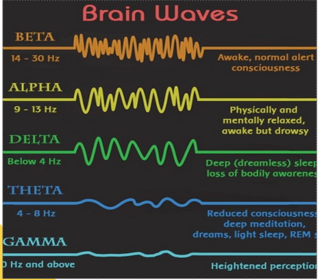

# Xerebro

```
Xerebro is a device which is used to help patients suffering from ADHD and other attention-deficient disorders by inducing a state of focus, or Beta mode. It also assists people who lack focus to improve their productivity.

Xerebro takes advantage of the difference in waves emitted by the brain during different phases or states of mind. Another property of the brain is it absorbs waves that surround it and try to induce that state within itself.

Using an oscilloscope, waves of a certain range of frequency (after required safety checks) are targeting the brain to induce a state of focus.

This is the principle on which Xerebro works.

```




## Hardware
- Arduino UNO / Raspberry Pi
- Oscilloscope
- 3D printer
- Soldering iron
- Sensors

## Software
- HTML
- CSS
- JS
- Django

# Team Members
- Alosh Denny
- Adithya Biju
- Anton Prince
- Sindhu P R
- Tanu Shree
- Abhinand D Manoj
